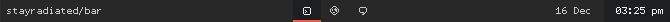

BAR
===

Basically it's [BAR (Bar Ain't Recursive) by LemonBoy](https://github.com/LemonBoy/bar) but using Node-Webkit.

It uses unix sockets to receive data in the same format as BAR.

Positives:

- Don't need to run XQuartz
- Mouse support
- Style via CSS

Negatives:

- More memory usage
- Acts like a regular window
  - Has a shadow
  - Can be moved by window managers
  - Rounded corners

## Instructions

### 1. Setting up

1. Download the latest version of node-webkit from https://s3.amazonaws.com/node-webkit/v0.8.2/node-webkit-v0.8.2-osx-ia32.zip

2. Extract the zip. You will have three files. The only one you need is `node-webkit.app`. Move it into your `/Applications` folder.

3. Using git, clone a copy of my repo with `git clone https://github.com/stayradiated/bar.git`. This will create a folder called `bar`, open it using `cd bar`.

4. To start the application, run the command:

        /Applications/node-webkit.app/Contents/MacOS/node-webkit .

  The `.` at the end is important. Hopefully, this should display the bar (by default at the top of the screen). At the moment it will be blank, because nothing is sending data to it.

5. Basically a socket has been created at `/tmp/bar.sock` and the application is listening to it waiting for instructions on what to print. Bar uses the same formatting as LemonBoys - https://github.com/LemonBoy/bar#text-formatting.

6. To close Bar, focus on it and press 'Cmd-Q', or select 'Quit bar' from the menu, or close it from the dock icon. DO NOT use ctrl-c to quit it from the terminal.

### 2. Using pipes

If you have used lemonboys bar, then you're probably used using pipes to write
text to it.

4. Edit the configuration file at `app/js/config.js`. Uncomment line 24 and edit the script path to match where you cloned the repo to.

        script: '~/Projects/Bar/bin/init_bar_script.sh'

  You can also edit the height of the bar, and it's position on the screen in this file.

5. Then edit the file `bin/init_bar_script.sh`. You will need to change the path on line 9:

        cat $PANEL_FIFO | node ~/Projects/Bar/bin/printer.js &

8. Start the bar again using the same command from 1.4. This is where using a simple terminal alias `alias nw="/Applications/node-webkit.app/Contents/MacOS/node-webkit"` comes in handy, as you can just run `nw .` whenever you want to start the app.

9. If everything works, then the Bar should be displayed again and nothing should crash.

10. Any information piped to `/tmp/bar.fifo` will be passed into `printer.js`. This file will format the data, such as setting the position, adding background and foreground colors etc, and then pass it to Bar through unix sockets.

11. Try running the command `echo 'S i can print text- to the bar' > /tmp/bar.fifo`. With any luck you should see the text appear in the bar. If you can't, try opening the dev panel by focusing on the bar and pressing ctrl-d and going to the console tab. You should see some text like this: http://i.imgur.com/yrmt9va.png.

### 3. Editing fonts and colours

1. Install SASS by following the instructions at http://sass-lang.com/install (bottom right section).

2. Colors, fonts and line height are defined in `source/main.scss`.

4. To compile the SASS, use the command `npm run-script css` from the bar folder.

5. To refresh the styles that Bar is using, focus on it, and then press the `r` key.

### 4. Daily routine

Once you have everything set up, you only need to do the following when you
start your computer to get Bar running:

    cd ~/Projects/Bar
    nw .
    
To close the app, simply focus on it, and press `Cmd + W`. This will automatically shutdown the sockets server as well.

## Configuration

Settings are stored in `app/js/config.js`.

Edit colours and load themes in `source/main.scss`. Recompile the styles by running `npm run-script css`.

## Hiding the menubar

I recommend you use a SIMBL plugin like [Menufela](https://github.com/fjolnir/menufela).

## Multiple Desktops

To show on multiple desktops, right click the dock icon, and select **Options** > **All Desktops**.

## Window Managers

If you use something like Zephyros, then you will be be annoyed when you accidentally move the Bar from it's position. To fix this I added a small `if` statement in my scrip that would ignore windows with height of `< ~30` pixels.

## Shadows

Use this: https://github.com/puffnfresh/toggle-osx-shadows

## Rounded corners

Edit SArtFile.bin using https://github.com/alexzielenski/sartFileTool and replace 54-1.png, 56-1.png, 89-1.png and 91-1.png. See [my config files](https://github.com/stayradiated/dotfiles/tree/master/OS%20X%20Theme) for more details.
